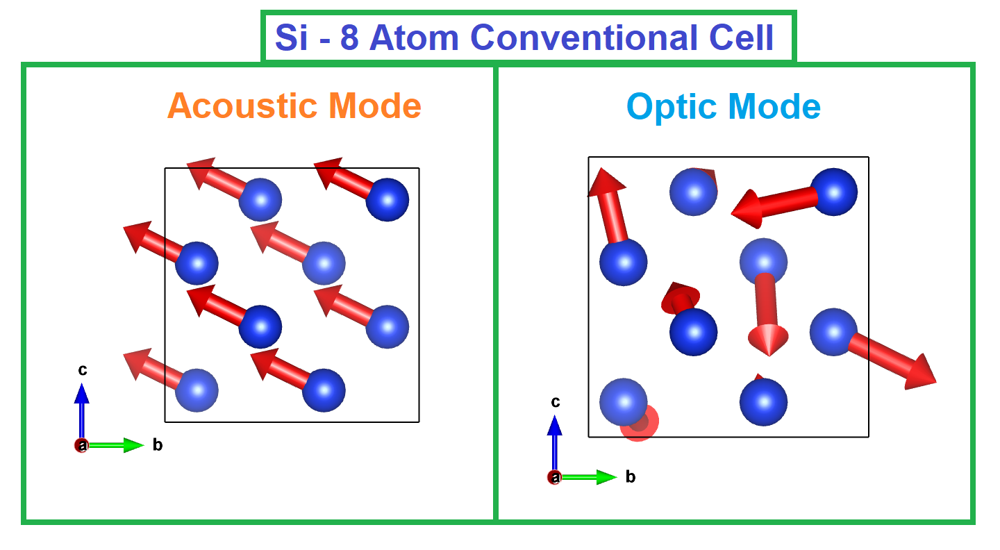
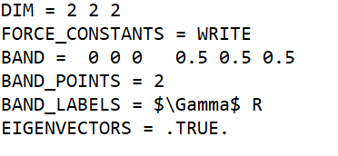
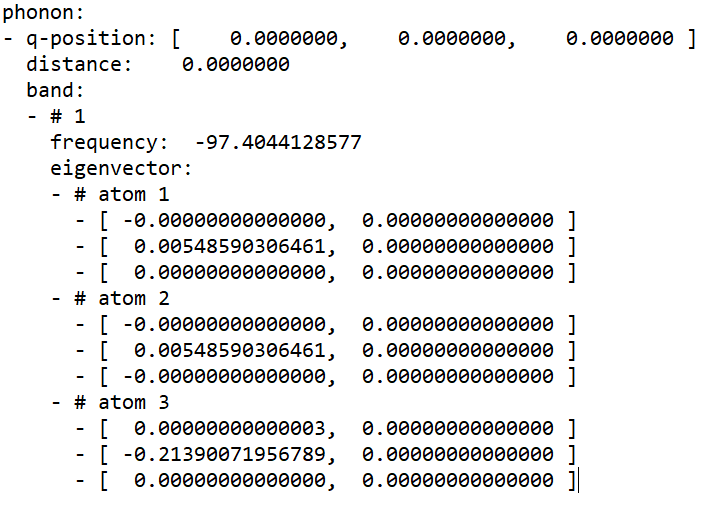

# Phonopy_VESTA
### Export Eigenvectors from Phonopy format to VESTA

This Code can Extract the Eigenvectors of Phonon Dispersion from Phonopy and plot it in VESTA Files for visualisation.

# Requirements :
`Phonopy`

`VESTA`

`Python`

#Check if the below libraries are present by trying to import in python

`numpy`

`sys`

`os`

`shutil`

# Steps :

### 1)  Save the Following as `band.conf` (Different for your material)

-----------------------------------------------------------------------

-------------------------------------------------------------------------

Please look at the Phonopy website for other required files for your interface (e.g, `VASP`, `QE`).
Note : Here I have used BAND_POINTS = 2 to find the eigenvectors only at the High Symmetry Points, you can use more.

### 2) RUN THIS AS
	$ phonopy -c POSCAR -p band.conf -s

Note : This lines are written for VASP interface, but simillar things are for other interfaces supported by phonopy e.g, for QE
	$ phonopy --qe -c prim_cell.in -p band.conf -s

### 3)  You should get `band.yaml` as an output with the following format

---------------------------------------------------------------------

      
------------------------------------------------------------------------

### 4)  Run
$ python3 extract_vectors_phonopy.py band.yaml POSCAR.vesta

Here `POSCAR.vesta` is the VESTA file of the primitive positions of atoms used in the initial SCF calculation, not the supercell from Phonopy.
To make it,
for `VASP` you can directly open `POSCAR` file in `VESTA` and save as `POSCAR.vesta`
Easiest way in `QE` is to export your input file to `.xsf` format by `XCRYSDEN` and open it in `VESTA` and futher save as `POSCAR.vesta`
Or if you used ibrav=0 in `QE`, then simply copy the `CELL_PARAMETERS` Card in Angstron units and `ATOMIC_POSITIONS` in Direct or Cartesian Format 
as in `VASP` `POSCAR` file, and save it as `POSCAR.vasp`, open it in `VESTA`, and save as `POSCAR.vesta`.
Please look in the internet on how to create such files for other supported interfaces, since I only have experience in `QE` and `VASP`.

Note : Typing `band.yaml` and `POSCAR.vesta` is completely optional, since the code, by default takes those two filenames as input, in case you have
the same files saved  in other names but in same format, you can put those names in the command line but should be in the same order. 
(See the code for more info)

### 5) 
Finally all the `VESTA files` are ready for visualization and will be saved in `VESTA_FILES` folder with each q-point and inside them, the VESTA files 
saved for each band with the name in format of `band_index_(frequency_in_cm-1)`. You can change the name of the files to any units by changing the Tag
`FREQUENCY_CONVERSION_FACTOR = 521.47083116` in `band.conf`, which converts from THz to cm-1. But keep in mind, as some bands are degenerate, 
the format of the files to be written should follow the trend as written in the code, other wise some degenerate bands with same frequency
will get overwritten and you wont get the number of `VESTA` files you are expecting for your material i.e., 3 x natoms.

I will keep updating the code, please comment if you face any problem.

# References
https://github.com/Stanford-MCTG/VASP-plot-modes
